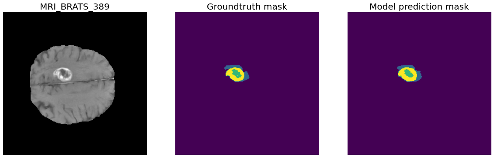
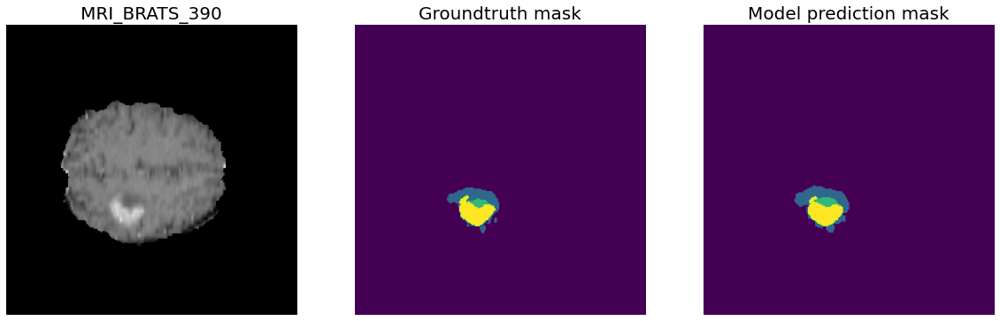
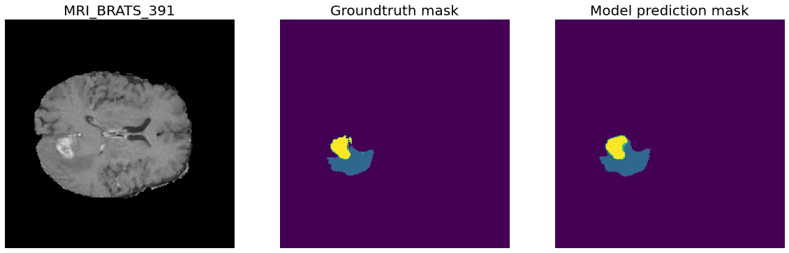
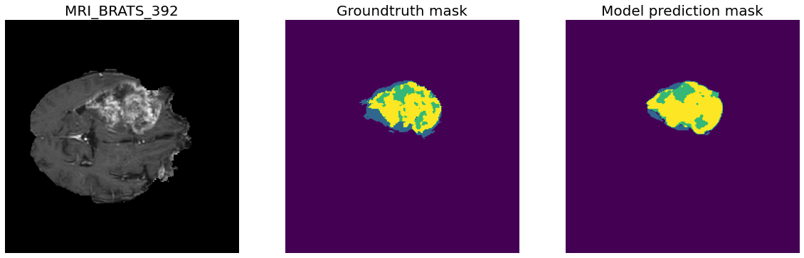
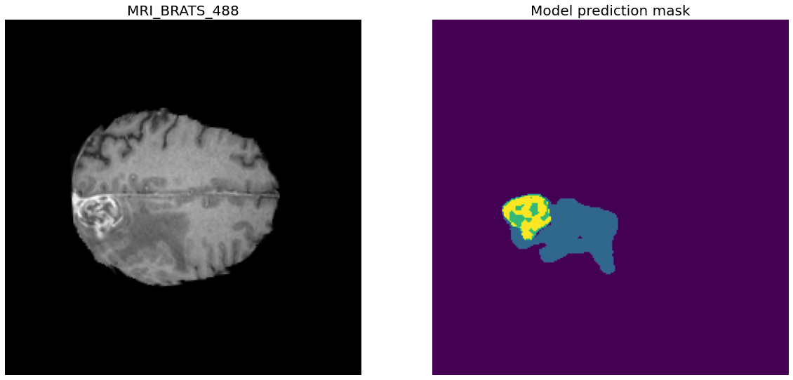
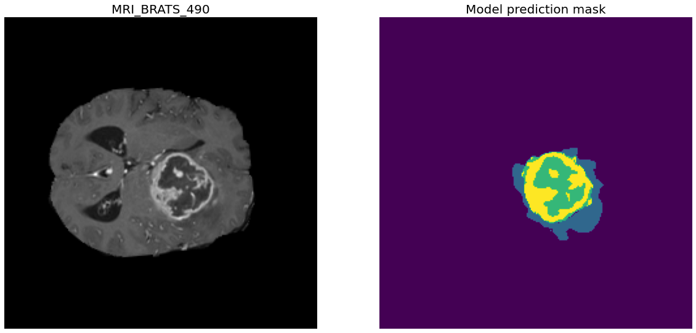

# 3D-mri-brain-tumour-image-segmentation-medical-decathlon-tensorflow
__Operating System__: Ubuntu 18.04 (you may face issues importing the packages from the requirements.yml file if your OS differs).

Code repository for training a brain tumour U-Net 3D image segmentation model using the 'Task01_BrainTumour' dataset from the  [medical segmentation decathlon challenge](https://decathlon-10.grand-challenge.org/) datasets.
Experiments using the rest of the 9 datasets from the challenge may be conducted in the future.

__Note__: This is __not meant as an official submission__ for the challenge since the challenge proposition describes that "teams __cannot manually__ tweak parameters of algorithms/models
on a task specific basis. Any parameter tuning has to happen automatically and algorithmically. As an example, the learning rate or the depth of a network cannot be manually
changed between tasks, but they can be found automatically through cross-validation. Any team which is found to use different human-defined and task-specific parameters will
be terminated". This repository uses __manual human-defined settings__ since the intetion is to explore image segmentation in a medical imaging context using the medical segmentation
decathlon datasets rather than participating in the automatic training hyperparameter tuning challenge itself.

Please let me know if you find mistakes and errors, or improvement ideas for the code and for future training experiments. Feedback would be greatly appreciated as this is work in progress.

### Medical Segmentation Decathlon datasets download links:
* [Official Google Drive link](https://goo.gl/QzVZcm)
* [Academic Torrents](https://academictorrents.com/details/274be65156ed14828fb7b30b82407a2417e1924a)
* [Medical Decathlon Datasets with my train/validation splits ](https://drive.google.com/file/d/15fHX4fOSYxbAiC5kk6bDkx-zcUAvfqFI/view?usp=sharing) (recommended for step 1 unless you would create the 'train' and 'val' folders with the 'images' and 'masks' subfolders yourself)

### Task01 BrainTumour model prediction outputs

__Task01 BrainTumour classes__:
* __Class 0: Background__
* __Class 1: Edema__
* __Class 2: Non-Enhancing Tumour__
* __Class 3: Enhancing Tumour__

#### Validation set images





#### Submission test images (no groundtruth masks available)



### Task01 BrainTumor model training settings and test metric values
__388 training files, 96 validation files__.

* __--model_architecture__ conv3dtranspose_batchnormalization
* __--unet_resize_factor__ 2
* __--num_classes__ 4
* __--num_channels__ 4
* __--weighted_classes__ True
* __--train_multi_gpu__ False
* __--training_epochs__ 250
* __--loss__ log_dice
* __--optimizer__ adam
* __--lr__ 0.0001 (with reduce LR on plateau by a factor of 0.1 with patience epochs=20)
* __--use_amsgrad_adam__ False
* __--train_batch_size__ 1
* __--val_batch_size__ 1
* __--mri_width__ 240
* __--mri_height__ 240
* __--mri_depth__ 160
* __--num_workers__ 4

Best performing epoch:
    
    Epoch 68/250
    388/388 [==============================] - 1364s 4s/step - loss: 0.9651 - dice_coefficient: 0.8470 - iou: 0.9862 - accuracy: 0.9971 - val_loss: 1.4426 - val_dice_coefficient: 0.8154 - val_iou: 0.9852 - val_accuracy: 0.9964

## Steps:
### 1- Creating separate chunk files from the medical decathlon datasets with a specified image height, width and depth sizes
```
    usage: create_separate_chunk_files_from_dataset.py [-h] --input_directory
                                                       INPUT_DIRECTORY
                                                       --output_directory
                                                       OUTPUT_DIRECTORY
                                                       [--image_height_size IMAGE_HEIGHT_SIZE]
                                                       [--image_width_size IMAGE_WIDTH_SIZE]
                                                       [--file_layer_size FILE_LAYER_SIZE]
                                                       [--use_last_chunk USE_LAST_CHUNK]
    
    optional arguments:
      -h, --help            show this help message and exit
      --input_directory INPUT_DIRECTORY
                            (Required) Path to dataset folder (must contain
                            'train/' and 'val/' subfolders with 'images' and
                            'masks' folders each)
      --output_directory OUTPUT_DIRECTORY
                            (Required) Path to output dataset folder that will
                            contain the splitted files (must contain 'train/' and
                            'val/' subfolders with 'images' and 'masks' folders
                            each)
      --image_height_size IMAGE_HEIGHT_SIZE
                            Required image height size per file layer slice to be
                            resized to in the output dataset image folder.
                            Default: (240)
      --image_width_size IMAGE_WIDTH_SIZE
                            Required image width size per file layer slice to be
                            resized to in the output dataset image folder.
                            Default: (240)
      --file_layer_size FILE_LAYER_SIZE
                            Required file layer size per file chunk of an original
                            file to in the output dataset image folder. Default:
                            (160)
      --use_last_chunk USE_LAST_CHUNK
                            Whether to use the last file chunk of the original
                            file that would be split into
                            "ceil(original_file_layer_size / file_layer_size)
                            files". If True: the last chunk will be used and the
                            rest of the layers would be padded with zeros.
                            Default: (True)
```

### 2- Training 3D image segmentation model

```
    usage: train_unet_segmentation_model.py [-h] --train_data_dir TRAIN_DATA_DIR
                                        --val_data_dir VAL_DATA_DIR
                                        [--model_architecture {upsampling_dropout,conv3dtranspose_dropout,upsampling_batchnormalization,conv3dtranspose_batchnormalization}]
                                        [--unet_resize_factor UNET_RESIZE_FACTOR]
                                        [--unet_dropout_rate UNET_DROPOUT_RATE]
                                        --num_classes NUM_CLASSES
                                        --num_channels NUM_CHANNELS
                                        [--weighted_classes WEIGHTED_CLASSES]
                                        [--train_multi_gpu TRAIN_MULTI_GPU]
                                        [--num_gpus NUM_GPUS]
                                        [--training_epochs TRAINING_EPOCHS]
                                        [--model_path MODEL_PATH]
                                        [--resume_train RESUME_TRAIN]
                                        [--loss {dice,log_dice}]
                                        [--optimizer {sgd,adam,nadam}]
                                        [--lr LR]
                                        [--use_nesterov_sgd USE_NESTEROV_SGD]
                                        [--use_amsgrad_adam USE_AMSGRAD_ADAM]
                                        [--train_batch_size TRAIN_BATCH_SIZE]
                                        [--val_batch_size VAL_BATCH_SIZE]
                                        [--mri_width MRI_WIDTH]
                                        [--mri_height MRI_HEIGHT]
                                        [--mri_depth MRI_DEPTH]
                                        [--num_workers NUM_WORKERS]

    Training U-Net 3D image segmentation model.
    
    optional arguments:
      -h, --help            show this help message and exit
      --train_data_dir TRAIN_DATA_DIR
                            (Required) Path to the train dataset folder
      --val_data_dir VAL_DATA_DIR
                            (Required) Path to the val dataset folder
      --model_architecture {upsampling_dropout,conv3dtranspose_dropout,upsampling_batchnormalization,conv3dtranspose_batchnormalization}
                            Which model architecture to build the binary 3D U-Net
                            segmentation with: ('upsampling_dropout','conv3dtransp
                            ose_dropout','upsampling_batchnormalization','conv3dtr
                            anspose_batchnormalization'), default:
                            'conv3dtranspose_batchnormalization'
      --unet_resize_factor UNET_RESIZE_FACTOR
                            (integer value) Resize factor of the number of filters
                            (channels) per Convolutional layer in the U-Net model
                            (must be >= 1, such that 1 means retaining the
                            original number of filters (channels) per
                            Convolutional layer in the U-Net model) (default: 2
                            (half the original size))
      --unet_dropout_rate UNET_DROPOUT_RATE
                            Dropout rate for the Dropout layers in the U-Net
                            model, must be < 1 and > 0 (default: 0.3)
      --num_classes NUM_CLASSES
                            (Required) Number of classes in dataset:
                            (Task01_BrainTumour: 4, Task02_Heart: 2, Task03_Liver:
                            3, Task04_Hippocampus: 3, Task05_Prostate: 3,
                            Task06_Lung: 2, Task07_Pancreas: 3,
                            Task08_HepaticVessel: 3, Task09_Spleen: 2,
                            Task10_Colon: 2)
      --num_channels NUM_CHANNELS
                            (Required) Number of channels in image mri file in
                            dataset (modality): (Task01_BrainTumour: 4,
                            Task02_Heart: 1, Task03_Liver: 1, Task04_Hippocampus:
                            1, Task05_Prostate: 2, Task06_Lung: 1,
                            Task07_Pancreas: 1, Task08_HepaticVessel: 1,
                            Task09_Spleen: 1, Task10_Colon: 1)
      --weighted_classes WEIGHTED_CLASSES
                            If set to True, train model with sample weighting; the
                            sample weights per class would be calculated from the
                            training set by the Data Generator (default: True)
      --train_multi_gpu TRAIN_MULTI_GPU
                            If set to True, train model with multiple GPUs.
                            (default: False)
      --num_gpus NUM_GPUS   Set number of available GPUs for multi-gpu training, '
                            --train_multi_gpu' must be also set to True (default:
                            1)
      --training_epochs TRAINING_EPOCHS
                            Required training epochs (default: 250)
      --model_path MODEL_PATH
                            Path to model checkpoint (default:
                            "unet_3d_segmentation_model.h5")
      --resume_train RESUME_TRAIN
                            If set to True, resume model training from model_path
                            (default: False)
      --loss {dice,log_dice}
                            Required segmentation loss function for training the
                            multiclass segmentation model: ('dice','log_dice'),
                            (default: 'log_dice')
      --optimizer {sgd,adam,nadam}
                            Required optimizer for training the model:
                            ('sgd','adam','nadam'), (default: 'adam')
      --lr LR               Learning rate for the optimizer (default: 0.0001)
      --use_nesterov_sgd USE_NESTEROV_SGD
                            Use Nesterov momentum with SGD optimizer: ('True',
                            'False') (default: False)
      --use_amsgrad_adam USE_AMSGRAD_ADAM
                            Use AMSGrad with adam optimizer: ('True', 'False')
                            (default: False)
      --train_batch_size TRAIN_BATCH_SIZE
                            Batch size for train dataset datagenerator, if
                            --train_multi_gpu then the minimum value must be the
                            number of GPUs (default: 1)
      --val_batch_size VAL_BATCH_SIZE
                            Batch size for validation dataset datagenerator, if
                            --train_multi_gpu then the minimum value must be the
                            number of GPUs (default: 1)
      --mri_width MRI_WIDTH
                            Input mri slice width (default: 240)
      --mri_height MRI_HEIGHT
                            Input mri slice height (default: 240)
      --mri_depth MRI_DEPTH
                            Input mri depth, must be a multiple of 16 for the 3D
                            U-Net model (default: 160)
      --num_workers NUM_WORKERS
                            Number of workers for fit_generator (default: 4)
```

### 3- Creating prediction submission files for the challenge 
__Note__: The submission instructions [link](https://decathlon-10.grand-challenge.org/evaluation/challenge/submissions/create/)

```
    usage: generate_prediction_files_for_challenge_submission.py
           [-h] --model_path MODEL_PATH [--model_loss {dice,log_dice}]
           --input_directory INPUT_DIRECTORY --output_directory OUTPUT_DIRECTORY
           [--image_height_size IMAGE_HEIGHT_SIZE]
           [--image_width_size IMAGE_WIDTH_SIZE]
           [--file_layer_size FILE_LAYER_SIZE] --num_classes NUM_CLASSES
    
    optional arguments:
      -h, --help            show this help message and exit
      --model_path MODEL_PATH
                            (Required) Path to trained model (.h5 file)
      --model_loss {dice,log_dice}
                            Segmentation loss function the segmentation model was
                            trained with: ('dice','log_dice'), (default:
                            'log_dice')
      --input_directory INPUT_DIRECTORY
                            (Required) Path to image folder containing the test
                            images to generate the predictions from ('ImagesTs'
                            folder in the original datasets')
      --output_directory OUTPUT_DIRECTORY
                            (Required) Path to output dataset folder that will
                            contain the model predictions
      --image_height_size IMAGE_HEIGHT_SIZE
                            Required image height size for model input. Default:
                            (240)
      --image_width_size IMAGE_WIDTH_SIZE
                            Required image width size for model input. Default:
                            (240)
      --file_layer_size FILE_LAYER_SIZE
                            Required file layer size for model input. Default:
                            (160)
      --num_classes NUM_CLASSES
                            (Required) Number of classes in dataset:
                            (Task01_BrainTumour: 4, Task02_Heart: 2, Task03_Liver:
                            3, Task04_Hippocampus: 3, Task05_Prostate: 3,
                            Task06_Lung: 2, Task07_Pancreas: 3,
                            Task08_HepaticVessel: 3, Task09_Spleen: 2,
                            Task10_Colon: 2)
```

### Useful tools:
* __SOCR 3D MRI Scan viewer__ (supports nifti files) for viewing the datasets' files in a nice GUI: [link](https://socr.umich.edu/HTML5/BrainViewer/)

### References:

* Simpson, A., Antonelli, M., Bakas, S., Bilello, M., Farahani, K., Ginneken, B., Kopp-Schneider, A., Landman, B., Litjens, G., Menze, B., Ronneberger, O., Summers, R., Bilic, P., Christ, P., Do, R., Gollub, M., Golia-Pernicka, J., Heckers, S., Jarnagin, W., McHugo, M., Napel, S., Vorontsov, E., Maier-Hein, L., & Cardoso, M.J. (2019). A large annotated medical image dataset for the development and evaluation of segmentation algorithms. ArXiv, abs/1902.09063. [link](https://arxiv.org/abs/1902.09063)
* Antonelli, M., Reinke, A., Bakas, S., Farahani, K., AnnetteKopp-Schneider, Landman, B., Litjens, G., Menze, B., Ronneberger, O., M.Summers, R., Ginneken, B., Bilello, M., Bilic, P., Christ, P., Do, R.K., Gollub, M., Heckers, S., Huisman, H., Jarnagin, W., McHugo, M., Napel, S., Pernicka, J.S., Rhode, K., Tobon-Gomez, C., Vorontsov, E., Meakin, J., Ourselin, S., Wiesenfarth, M., Arbeláez, P., Bae, B., Chen, S., Daza, L., Feng, J., He, B., Isensee, F., Ji, Y., Jia, F., Kim, N., Kim, I., Merhof, D., Pai, A., Park, B., Perslev, M., Rezaiifar, R., Rippel, O., Sarasua, I., Shen, W., Son, J., Wachinger, C., Wang, L., Wang, Y., Xia, Y., Xu, D., Xu, Z., Zheng, Y., Simpson, A.L., Maier-Hein, L., & Cardoso, M. (2021). The Medical Segmentation Decathlon. ArXiv, abs/2106.05735. [link](https://arxiv.org/abs/2106.05735)


### Hardware Specifications
* TITAN RTX Graphics Card (24 gigabytes Video RAM).
* i9-9900KF Intel CPU overclocked to 5 GHz.
* 32 Gigabytes DDR4 RAM at 3200 MHz.
